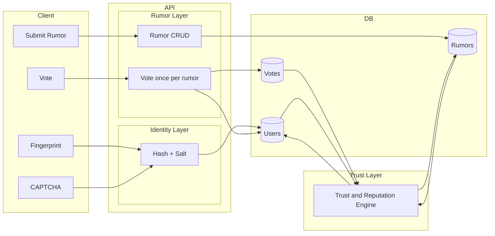

## Team
**Team Name:** BINARY ROOKIES  
**Team Members:** Eshal Ayub, Momna Khalid, Ayan Asif Hashmi, Fahad Mehmood

# Day 1 Submission: Anonymous Campus Rumor System

**Problem understanding, assumptions, proposed solution, system architecture, and trust score mechanism.**

---

## 1. Problem Understanding

The goal is an **anonymous campus rumor system** where students can submit and vote on rumors without any central server or admin deciding what is true. Truth and verification must emerge from participant behavior alone.

**Hard constraints:**

- **No central authority for truth** — no admin or server “confirming” or “denying” rumors.
- **Anonymous but unique participants** — one human should map to one anonymous identity; no PII collected.
- **No multiple voting** — each identity can vote at most once per rumor, enforced without collecting real identity.
- **Popularity ≠ truth** — a rumor with more votes must not automatically be treated as true; the system must weight votes by something other than raw count (e.g. voter reputation).
- **Explicit issues to address:**

  1. **Score instability** — verified facts from last month are mysteriously changing their scores. The design must produce **stable** trust scores (e.g. via finalization or time decay).

  2. **Bot manipulation** — some users create bot accounts to manipulate votes. The design must combine **rate limiting, CAPTCHA, and reputation** so low-rep or bad-accuracy voters have minimal impact.

  3. **Deleted-rumor bug** — deleted rumors are still affecting the trust scores of newer related rumors. The design must **isolate deleted rumor data** so they do not feed into trust or reputation after deletion (e.g. soft-delete with exclusion from all trust/reputation calculations).

  4. **Sybil resistance** — prove or argue mathematically that a **coordinated group of liars cannot game** the system without central control; the argument is formalized in the Gameability section below.

---

## 2. Assumptions Made

- **One deployment per campus** — one anonymous_id space per instance; no cross-campus identity.
- **“Verified” is system-derived** — “verified” means outcome inferred from consensus and time (e.g. finalization window), not an admin button.
- **Device fingerprint + CAPTCHA for hackathon** — Option A (fingerprint + one-time CAPTCHA) is acceptable; full Zero-Knowledge Proof is not required.
- **Rumors are immutable** — once submitted, rumor content is not edited; only votes and derived scores change.
- **Deleted rumors are excluded everywhere** — soft-deleted rumors and their votes are excluded from all future trust and reputation computations and optionally from public listing.
- **Malicious coordinators are a minority** — the gameability argument holds when the fraction of participants who coordinate to lie is less than the honest majority; if everyone coordinates, no reputation system can fix that without an external signal.

---

## 3. Proposed Solution & Approach

The solution is structured in **three layers**.

### Identity Layer (anonymous but unique)

- `anonymous_id = hash(device_fingerprint + salt)`.  
- One-time CAPTCHA at first use.  
- Only the hash is stored; no PII. Same device ⇒ same ID; one identity per device in practice.

### Rumor Layer (submission + voting)

- Anyone can submit a rumor: store `Rumor { id, content, creator_id, timestamp }`.  
- Votes are stored as `(rumor_id, voter_id, vote: true | false | neutral)`.  
- **One vote per (rumor_id, voter_id)**; enforced in DB and API. No censorship; no central authority.

### Trust Layer (authenticity over popularity)

- Trust score of a rumor = **reputation-weighted** sum of votes, not raw vote count.  
- Each voter has a **reputation score**; reputation is updated by past accuracy (agreement with eventual consensus).  
- So: more votes do not imply more true; **high-rep voters** have more weight. Details are in Section 5.

**High-level flow:**  
Client collects fingerprint → CAPTCHA → backend returns/creates `anonymous_id`. Client submits rumor → backend inserts Rumor. Client votes → backend inserts Vote iff no existing (rumor_id, voter_id). Periodically or on read, a **Trust & Reputation** component computes trust scores and updates reputations, **excluding soft-deleted rumors and their votes** from all calculations.

---

## 4. System Architecture Design

### 4.1 Data Model (conceptual)

```text
Rumor:  rumor_id, content, creator_id (anonymous), timestamp, soft_deleted?
Vote:   rumor_id, voter_id (anonymous), vote (true | false | neutral), timestamp
User:   anonymous_id, reputation_score, accuracy_metric, created_at
```

- **Rumor**: content and creator are immutable; `soft_deleted` (or `deleted_at`) marks removal from all trust/reputation logic and optionally from listing.
- **Vote**: unique per (rumor_id, voter_id); votes on deleted rumors are ignored in every computation.
- **User**: one row per anonymous_id; reputation and accuracy drive vote weight in the trust formula.

### 4.2 Flow

1. **Identity**: Client sends fingerprint (+ CAPTCHA result); backend hashes with salt, creates or looks up `anonymous_id`, returns it. Stored only the hash.
2. **Submit rumor**: Client sends content + creator_id; backend inserts Rumor with timestamp.
3. **Vote**: Client sends rumor_id, voter_id, vote; backend inserts Vote only if no Vote exists for (rumor_id, voter_id).
4. **Trust & Reputation**: A backend component (periodic job or on-read) reads Rumors (excluding soft_deleted), Votes (only on non-deleted rumors), and User reputations; computes trust score per rumor and updates User reputation from “outcomes” of finalized rumors. **Soft-deleted rumors and their votes are never read for trust or reputation.**

### 4.3 Architecture Diagram



- **Identity Layer**: client (fingerprint + CAPTCHA) + API (hash, salt, create/lookup anonymous_id).  
- **Rumor Layer**: API (Rumor CRUD, single vote per (rumor_id, voter_id)) + DB (Rumors, Votes, Users).  
- **Trust Layer**: backend engine that reads Rumors (excluding soft_deleted), Votes, and Users; writes back trust scores (e.g. on Rumor or separate store) and updated User reputation. The engine **explicitly excludes soft_deleted rumors** and any votes on them.

---

## 5. Trust Score Mechanism

### 5.1 Trust Score of a Rumor

- Only votes on **non-deleted** rumors are used. Deleted rumors are excluded from this formula and from any “outcome” used for reputation.

**Formula (at time t):**

```text
Trust(Rumor r) = Σ (vote_weight(v) × Reputation(voter)) / Σ Reputation(voter)
```

- `vote_weight(true) = 1`, `vote_weight(false) = -1`, `vote_weight(neutral) = 0` (or a small ε).  
- Denominator = sum of reputations of all voters on rumor r. Score lies in a bounded interval (e.g. [-1, 1]).  
- So: **not all votes are equal** — high-rep voters move the score more; low-rep or bot votes have minimal impact.

### 5.2 Reputation Update

- **Outcome of a rumor**: After a **finalization window** (e.g. 7 days), the rumor’s trust score at that time (or at finalization) is treated as the provisional outcome. Thresholds: e.g. above 0.6 ⇒ “true”, below -0.6 ⇒ “false”, else “neutral”.
- For each voter who voted on that rumor:
  - Vote agrees with outcome ⇒ reputation ↑  
  - Vote disagrees ⇒ reputation ↓  
  - Neutral vote ⇒ small or zero change  
- **New users**: Start with a low positive reputation (e.g. 0.1) so they can vote but cannot swing scores until they build accuracy.

### 5.3 Score Stability (“Verified Facts Changing”)

- **Finalization**: After a fixed window (e.g. 7 days), the rumor’s “outcome” used for reputation is **fixed**. Optionally display “final trust score” and “finalized at” so past facts do not keep changing.
- **Alternative**: Exponential time decay so newer votes matter more than old; the displayed score stabilizes as new votes taper off.

### 5.4 Deleted Rumors (Bug Fix)

- **Soft-delete**: Rumors are marked `deleted_at` or `soft_deleted = true`, not hard-deleted.
- **Exclusion** in every computation:
  - Do **not** use votes on deleted rumors in the numerator or denominator of any trust score.
  - Do **not** use outcomes of deleted rumors to update voter reputation.
- So the bug “deleted rumors still affecting trust scores of newer related rumors” is fixed by **removing deleted rumors and their votes from all trust and reputation pipelines**.

### 5.5 Bot / Sybil Mitigation

- **CAPTCHA** at identity creation; **rate limiting** per anonymous_id (e.g. max N rumors per day, M votes per hour).
- **Reputation**: Bots that vote badly get low reputation quickly ⇒ their votes have negligible weight in the trust formula.
- **Anomaly detection (conceptual)**: e.g. many new IDs voting in lockstep ⇒ flag or temporarily down-weight until behavior aligns with high-rep users.

---

## 6. Gameability Argument (No Central Control)

**Claim:** A coordinated group of liars cannot reliably make false rumors “true” or true rumors “false” without the system eventually self-correcting, as long as (a) they are a **minority** of participants, and (b) reputation is updated from outcomes derived from the **same** system.

**Idea:**

- Liars can create many fake IDs (Sybils). Each new ID starts with **low reputation**.
- Trust score = **weighted sum by reputation**. So a large number of low-rep liars contribute less than a smaller number of high-rep honest voters.
- Over time, liars who consistently vote against the majority (or against high-rep consensus) receive **negative or low reputation updates** ⇒ their future votes count even less.
- Coordination is limited by the need to **build reputation**, which requires being on the “correct” side of many rumors. Liars can either (i) vote with the truth and build rep (then they are not distorting), or (ii) vote with the lie and stay low-rep (then their impact is bounded).

**Math (sketch):**  
Let H = set of honest voters, L = liars. Total weight W = W_H + W_L. Suppose each liar has reputation at most r_L and each honest voter has reputation at least r_H, with r_L ≤ r_H / k for some k > 1. If liars are at most half of all voters, then W_L ≤ (n/2) r_L and W_H ≥ (n/2) r_H, so W_L / W_H ≤ r_L / r_H ≤ 1/k. Thus the trust score is dominated by honest voters’ votes. So the system cannot be gamed by a minority of coordinated liars as long as they cannot quickly gain reputation (which would require voting “correctly” and thus not distorting).

**Caveat:** If the **majority** of participants coordinate to lie, no reputation system can recover truth without an external signal. The argument assumes **malicious coordinators are a minority**.
